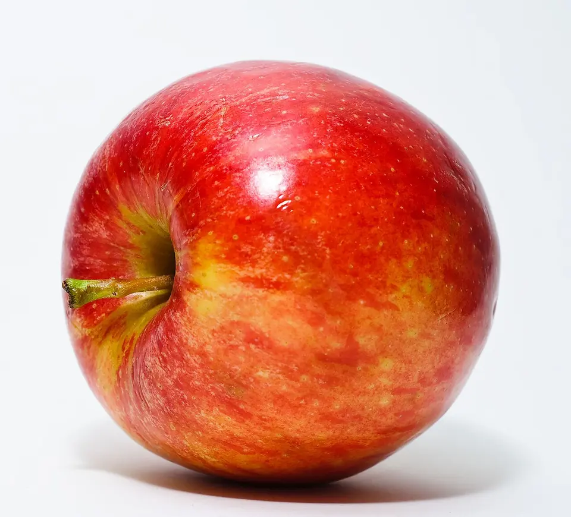
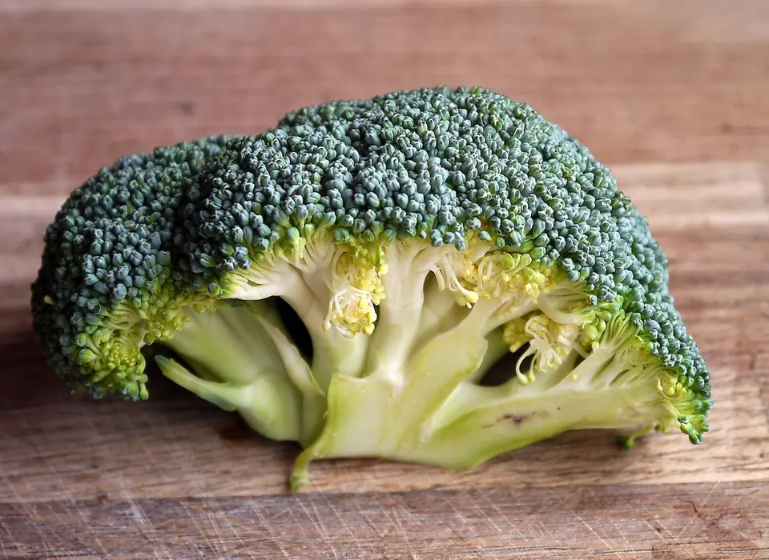
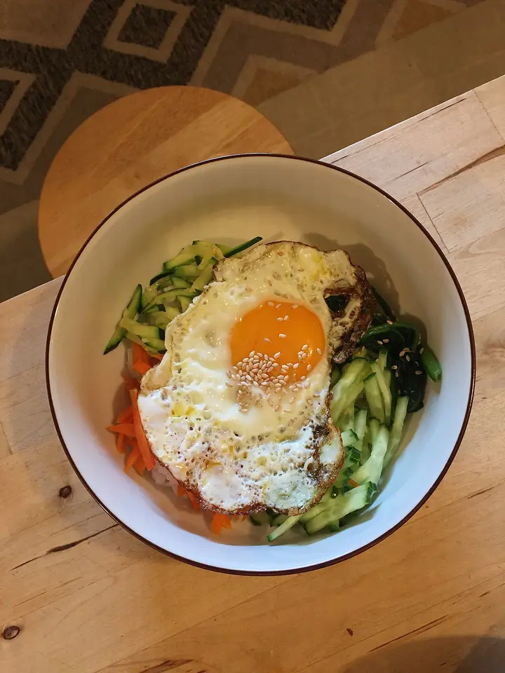
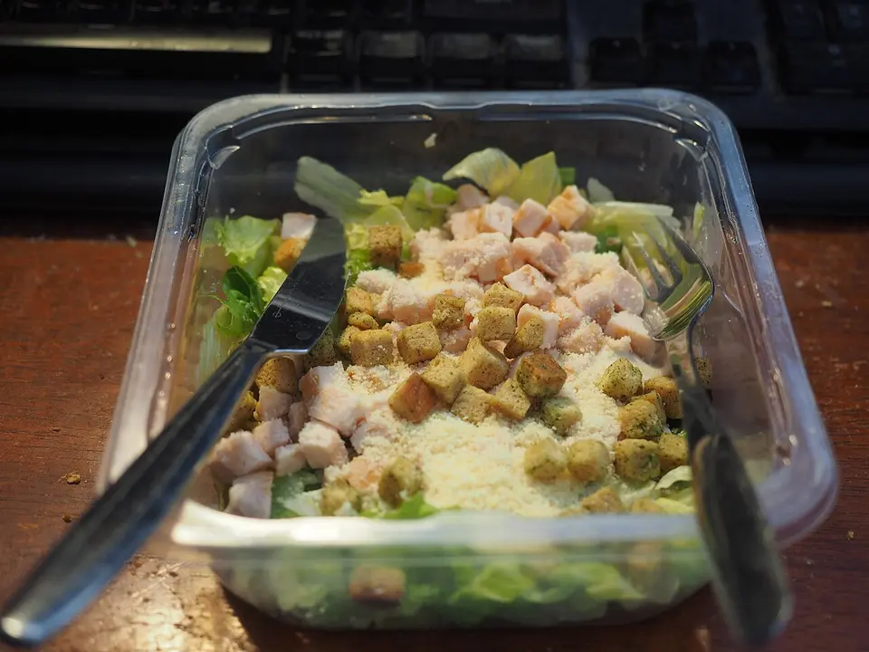
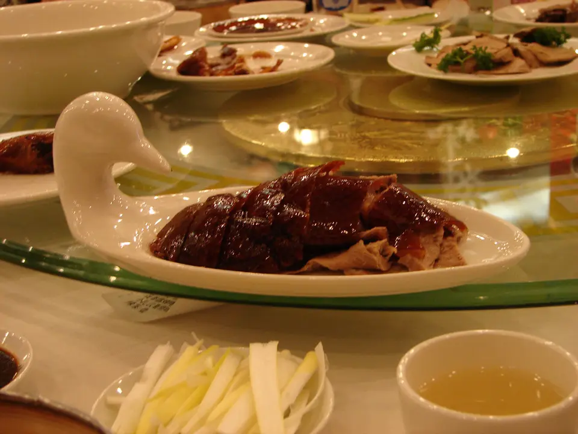
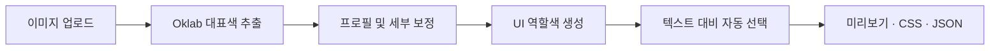

<div align="center">

# 🎨 UI 컬러 로직 스튜디오

### 이미지 한 장을, 바로 사용할 수 있는 UI 팔레트로

대표색 추출부터 색상 보정, 텍스트 대비, 상품·콘텐츠·배너 미리보기까지<br />
브라우저 안에서 한 번에 처리하는 로컬 컬러 분석 도구입니다.

<p>
  
  
  
  
</p>

[**HTML 매뉴얼**](https://ui-color-logic-studio.study2100-ai.chatgpt.site/manual.html) ·
[**9:16 소개 카드**](https://ui-color-logic-studio.study2100-ai.chatgpt.site/promo.html)

<sub>호스팅 화면은 접근 권한이 필요할 수 있습니다. GitHub에서 내려받은 로컬 버전은 별도 AI 도구 없이 실행됩니다.</sub>

</div>

---

## ✨ 한눈에 보기

<table>
  <tr>
    <td width="50%" valign="top">
      <h3>🎯 대표색 자동 추출</h3>
      <p>이미지를 Oklab 색 공간으로 분석해 점유율과 색차를 기준으로 대표색 후보를 찾습니다.</p>
    </td>
    <td width="50%" valign="top">
      <h3>🪄 UI용 색상 보정</h3>
      <p>균형형·소프트·볼드·다크 프로필과 채도·온도·표면 틴트 조절을 제공합니다.</p>
    </td>
  </tr>
  <tr>
    <td width="50%" valign="top">
      <h3>◐ 텍스트 대비 자동 선택</h3>
      <p>배경 밝기와 WCAG 대비율을 계산해 검정 또는 흰색 계열 텍스트를 자동 적용합니다.</p>
    </td>
    <td width="50%" valign="top">
      <h3>💾 작업 자동 복원</h3>
      <p>업로드 이미지와 분석 결과를 IndexedDB에 저장하고 프로젝트 이름별로 복원합니다.</p>
    </td>
  </tr>
</table>

> [!IMPORTANT]
> 실행 중 **AI 모델, 외부 API, API 키, 서버 데이터베이스가 필요하지 않습니다.** 이미지 분석은 사용자의 브라우저에서 처리됩니다.

## 🖼️ 포함된 테스트 이미지

<table>
  <tr>
    <td align="center"><br /><b>과일</b></td>
    <td align="center"><br /><b>야채</b></td>
    <td align="center"><br /><b>한식</b></td>
    <td align="center"><br /><b>양식</b></td>
    <td align="center"><br /><b>중식</b></td>
  </tr>
</table>

과일, 야채, 한식, 양식, 중식 각 10장씩 **총 50장**을 포함합니다. 최초 분석 결과는 설정별로 캐시되므로 사이트를 열 때마다 50장을 다시 분석하지 않습니다.

---

## 🚀 3분 안에 실행

### 1. 프로젝트 다운로드

```bash
git clone https://github.com/ousia-web3/ui-color-logic-studio.git
cd ui-color-logic-studio
```

### 2. 설치 및 실행

```bash
npm install
npm run dev
```

### 3. 브라우저 열기

```text
http://localhost:5173
```

> [!TIP]
> Windows 11의 PowerShell과 명령 프롬프트에서도 같은 명령을 사용할 수 있습니다. 저장된 프로젝트가 항상 같은 브라우저 저장 공간을 사용하도록 개발 포트는 `5173`으로 고정되어 있습니다.

### Vercel과 같은 운영 빌드로 로컬 확인

```bash
npm run build:local
npm run start
```

### 준비 사항

| 항목 | 기준 |
| --- | --- |
| 운영체제 | Windows 11, macOS, Linux |
| Node.js | `22.13.0` 이상 |
| 인터넷 | 최초 `npm install` 및 테스트 이미지 출처 확인 시 필요 |
| AI 도구 | 필요 없음 |

---

## ▲ Vercel 배포

이 저장소는 로컬 실행과 Vercel 배포를 함께 지원합니다. `vercel.json`이 표준 Next.js 빌드인 `next build`를 자동으로 사용합니다.

1. Vercel에서 **Add New → Project**를 선택합니다.
2. GitHub 저장소 `ousia-web3/ui-color-logic-studio`를 가져옵니다.
3. Framework Preset이 **Next.js**인지 확인합니다.
4. 별도 환경변수 없이 **Deploy**를 실행합니다.

| 환경 | 실행 방식 | 프로젝트 저장소 |
| --- | --- | --- |
| 로컬 | `npm run dev` | `http://localhost:5173`의 IndexedDB |
| Vercel | GitHub 연결 후 자동 배포 | Vercel Production 주소의 IndexedDB |

> [!NOTE]
> 로컬과 Vercel은 서로 다른 브라우저 저장 영역을 사용합니다. 프로젝트를 옮길 때는 **프로젝트 JSON 내보내기·불러오기**를 사용하세요. Vercel에서는 배포마다 주소가 달라지는 Preview URL보다 고정된 Production URL 사용을 권장합니다.

---

## 🧭 사용 흐름



1. 이미지를 한 장 이상 업로드하거나 **테스트 50장 불러오기**를 선택합니다.
2. 보정 프로필과 채도, 색온도, 표면 틴트, 최소 대비를 조절합니다.
3. `RAW KEY → CORRECTED` 결과와 대표색 후보를 비교합니다.
4. 상품, 콘텐츠, 배너 탭에서 실제 UI 조합을 확인합니다.
5. 제목·설명·메타·버튼 문구와 역할색을 필요에 따라 수정합니다.
6. **CSS 복사** 또는 **프로젝트 JSON**으로 결과를 내보냅니다.

## 🧩 생성되는 결과

| 결과 | 설명 |
| --- | --- |
| **상품 카드** | 이미지와 상품 정보가 세로형 그라데이션으로 자연스럽게 연결됩니다. |
| **콘텐츠 카드** | 이미지 분위기를 유지하면서 제목과 설명의 가독성을 확보합니다. |
| **배너** | 데스크톱에서는 이미지와 텍스트 영역을 가로 그라데이션으로 연결합니다. |
| **CSS 변수** | 역할별 색상을 복사해 실제 UI에 바로 적용할 수 있습니다. |
| **프로젝트 JSON** | 이미지, 팔레트, 설정, 문구, 검수 상태를 함께 백업합니다. |

### 텍스트 색상은 무조건 검정이 아닙니다

배경이 밝으면 어두운 텍스트를, 배경이 어두우면 흰색 텍스트를 선택합니다. 보조 텍스트와 CTA 텍스트도 목표 대비를 만족하도록 각각 계산합니다.

```text
밝은 배경    →  어두운 텍스트
어두운 배경  →  흰색 텍스트
경계 영역    →  목표 대비율을 만족하는 안전한 색상
```

<details>
<summary><b>생성되는 UI 역할색 10개 보기</b></summary>

| 역할 | CSS 변수 | 용도 |
| --- | --- | --- |
| Key | `--ui-key` | 대표 강조색 |
| On Key | `--ui-key-foreground` | 대표 강조색 위 텍스트 |
| Surface | `--ui-surface` | 카드 및 정보 영역 바탕 |
| Gradient A | `--ui-gradient-top` | 이미지와 연결되는 시작색 |
| Gradient B | `--ui-gradient-bottom` | 그라데이션 끝 및 본문 배경 |
| Text | `--ui-text-primary` | 주요 텍스트 |
| Muted | `--ui-text-secondary` | 설명과 메타 정보 |
| Accent | `--ui-accent` | 버튼과 상태 강조 |
| On Accent | `--ui-accent-foreground` | 버튼 위 텍스트 |
| Border | `--ui-border` | 경계선과 구분 요소 |

</details>

<details>
<summary><b>CSS 출력 예시 보기</b></summary>

```css
:root {
  --ui-key: #B96832;
  --ui-key-foreground: #151514;
  --ui-surface: #F4E5DB;
  --ui-gradient-top: #D8A987;
  --ui-gradient-bottom: #EAC7AE;
  --ui-text-primary: #151514;
  --ui-text-secondary: #5D5149;
  --ui-accent: #8F7330;
  --ui-accent-foreground: #FFFFFF;
  --ui-border: #D0BDB0;
}
```

실제 값은 업로드 이미지와 보정 설정에 따라 달라집니다.

</details>

---

## 💾 저장·복원·백업

| 기능 | 동작 |
| --- | --- |
| 자동 저장 | 업로드 이미지, 분석값, 보정값, 문구, 검수 상태를 IndexedDB에 저장 |
| 재실행 복원 | 브라우저 종료 또는 PC 재부팅 후 마지막 프로젝트 자동 복원 |
| 프로젝트 관리 | 프로젝트 이름별 생성·전환·현재 프로젝트 삭제 |
| JSON 백업 | 이미지 데이터가 포함된 프로젝트 파일 내보내기·불러오기 |
| 테스트 캐시 | 무채색 제외 설정별 테스트 50장 분석 결과 재사용 |
| 전체 초기화 | 모든 프로젝트, 이미지, 분석값, 설정, 테스트 캐시 삭제 |

> [!WARNING]
> 브라우저 저장소는 **현재 브라우저 프로필과 접속 주소**에 귀속됩니다. 시크릿 모드, 브라우저 데이터 삭제, 다른 PC로 이동하기 전에는 프로젝트 JSON을 별도로 보관하세요.

## 🌈 이미지와 UI를 잇는 그라데이션

상품·콘텐츠·배너의 이미지 영역과 정보 영역 사이에 별도 구분선을 사용하지 않습니다. 이미지 끝부분 위에 투명색에서 팔레트 배경색으로 이어지는 짧은 오버레이를 겹쳐 경계를 자연스럽게 흐립니다.

| 화면 | 연결 방향 | 적용 범위 |
| --- | --- | --- |
| 상품·콘텐츠 | 이미지 하단 → 정보 영역 | 약 15% |
| 데스크톱 배너 | 이미지 → 텍스트 영역 | 약 15% |
| 모바일 배너 | 이미지 하단 → 텍스트 영역 | 약 15% |

그라데이션 높이를 조절하려면 `app/globals.css`의 `.photo-bridge`에서 `height: 15%` 값을 변경합니다. `linear-gradient()` 안의 중간 퍼센트는 요소 높이가 아니라 색상 전환 위치입니다.

---

## 🧪 테스트 데이터 구성

| 분류 | 수량 | 예시 |
| --- | ---: | --- |
| 🍎 과일 | 10 | 사과, 바나나, 오렌지, 키위, 포도 |
| 🥕 야채 | 10 | 토마토, 당근, 브로콜리, 파프리카, 가지 |
| 🍚 한식 | 10 | 비빔밥, 김치찌개, 불고기, 떡볶이, 김밥 |
| 🍝 양식 | 10 | 피자, 파스타, 스테이크, 크루아상, 연어 |
| 🥟 중식 | 10 | 베이징덕, 마파두부, 딤섬, 볶음밥, 훠궈 |

이미지는 `public/test-images/`에 WebP 형식으로 포함되어 있습니다. 원본 Wikimedia Commons 페이지와 라이선스 정보는 [`manifest.json`](public/test-images/manifest.json)에서 확인할 수 있습니다.

> 이미지를 재배포하거나 상업적으로 사용할 때는 원본 페이지의 저작자 표시와 라이선스 조건을 개별적으로 확인하세요.

## ❓ 자주 묻는 질문

<details open>
<summary><b>GitHub에서 내려받아 사용할 때 AI 도구가 필요한가요?</b></summary>

아니요. `npm install` 후 `npm run dev`만 실행하면 됩니다. 컬러 분석은 브라우저 Canvas와 TypeScript 로직으로 처리됩니다.

</details>

<details>
<summary><b>테스트 이미지 50장을 접속할 때마다 다시 분석하나요?</b></summary>

아니요. 최초 분석 결과가 IndexedDB의 테스트 캐시에 저장됩니다. 보정 설정에 필요한 캐시가 있으면 즉시 재사용합니다.

</details>

<details>
<summary><b>직접 업로드한 이미지는 PC 재부팅 후에도 남아 있나요?</b></summary>

같은 브라우저 프로필과 `http://localhost:5173` 주소를 사용하면 자동 복원됩니다. 브라우저 데이터 삭제나 다른 PC 이동에 대비하려면 프로젝트 JSON도 함께 보관하세요.

</details>

<details>
<summary><b>업로드한 이미지가 서버로 전송되나요?</b></summary>

아니요. 이미지는 브라우저 내부에서 분석되고 IndexedDB에 저장됩니다.

</details>

---

## 🛠️ 기술 구성

<p>
  
  
  
  
  
</p>

- 브라우저 Canvas API
- Oklab 기반 대표색 군집화
- IndexedDB 프로젝트·캐시 저장
- WCAG 대비율 계산
- React 19 + TypeScript + Next.js 16 + Vinext + Vite 8

<details>
<summary><b>프로젝트 구조 보기</b></summary>

```text
app/
  page.tsx                  메인 화면과 상태 관리
  globals.css               레이아웃, 미리보기, 그라데이션 스타일
lib/
  color-engine.ts           색 추출·보정·대비 계산 로직
  project-storage.ts        IndexedDB 프로젝트·테스트 캐시 저장소
  test-image-set.ts         50장 테스트 데이터 정의
public/
  manual.html               독립 실행형 한국어 사용 매뉴얼
  promo.html                9:16 소개 카드 6종과 PNG 저장 기능
  test-images/              테스트용 WebP 이미지와 출처 manifest
tsconfig.next.json          Next.js·Vercel 전용 타입 검사 범위
vercel.json                 Vercel Next.js 빌드 설정
scripts/
  download-test-images.mjs  테스트 이미지 수집·변환 스크립트
tests/                      렌더링 및 UI 구성 검사
```

</details>

<details>
<summary><b>npm 명령 보기</b></summary>

| 명령 | 용도 |
| --- | --- |
| `npm run dev` | Next.js 로컬 개발 서버를 5173 포트로 실행 |
| `npm run build:local` | 표준 Next.js 운영 빌드 |
| `npm run build:vercel` | Vercel이 사용하는 Next.js 빌드 |
| `npm run start` | Next.js 운영 빌드를 5173 포트로 실행 |
| `npm run dev:sites` | 기존 Sites/Vinext 개발 서버 실행 |
| `npm run build:sites` | 기존 Sites/Vinext 호스팅 빌드 |
| `npm run lint` | ESLint 검사 |
| `npm run build` | Sites 호스팅용 검증 빌드 |
| `npm test` | Sites 빌드 후 렌더링 테스트 실행 |

</details>

## 📄 라이선스

현재 프로젝트 코드에는 별도 `LICENSE` 파일이 없습니다. 저장소가 공개되어 있어도 자동으로 자유 이용이 허용되는 것은 아닙니다. 테스트 이미지는 프로젝트 코드와 별개이며 각 Wikimedia Commons 원본 페이지의 라이선스를 따릅니다.

---

<div align="center">
  <b>사진의 분위기는 살리고, 정보는 더 선명하게.</b><br />
  <sub>UI 컬러 로직 스튜디오</sub>
</div>
